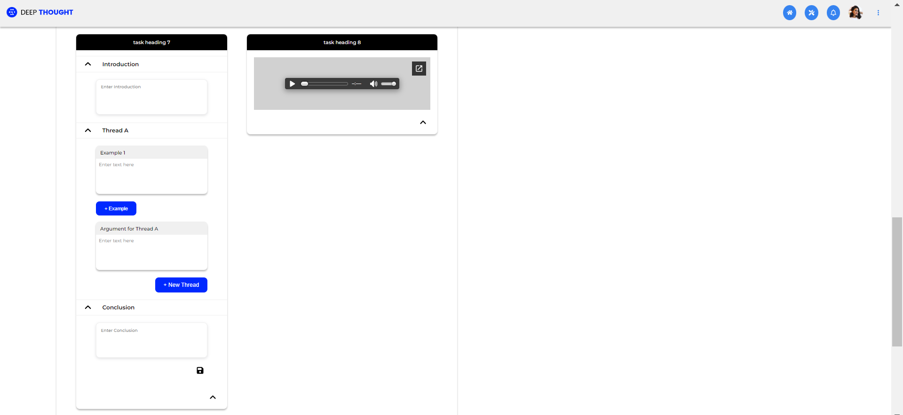

# Deep Thought - Agile SoftDev Front-end Developer Assignment

## Table of contents

- [Problem Statement](#problem-statement)
- [Screenshots](#screenshots)
- [Build With](#build-with)
- [Author](#author)

## Problem Statement

### TASK 1

- Create the HTML/CSS code for the applicant's storyboard feature
- FIGMA files are provided (single page, with two states)

### TASK 2

- Given: JSON objects and functionality detail
- Todo: Execute a dynamic page with the functionality

## Screenshots

## Build With

- HTML5 Semantic markup
- CSS custom properties
- CSS Flexbox
- CSS Grid
- Desktop-first workflow
- Vanilla JavaScript
- FontAwesome - For Icons

## Author

Purnima Kumar

- GitHub - [@purnimakumarr](https://github.com/purnimakumarr)
- Resume - [Purnima Kumar's Resume](https://drive.google.com/file/d/1irX1J0xEVyPZ58Pxmd-o8E1FnzDetwT1/view?usp=sharing)
