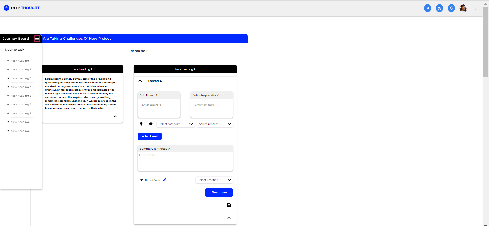

# Deep Thought HTML/CSS Web Designer Assignment (Task 1 - Web Page Creation)

## Table of contents

- [Problem Statement](#problem-statement)
- [Screenshots](#screenshots)
- [Build With](#build-with)
- [Author](#author)

## Problem Statement

- Create the HTML/CSS code for the applicant's storyboard feature
- FIGMA files are provided (single page, with two states)

## Screenshots

 

 

 

 

 

## Build With

- HTML5 Semantic markup
- CSS custom properties
- CSS Flexbox
- CSS Grid
- Desktop-first workflow
- Vanilla JavaScript (to toggle between states)
- FontAwesome - For Icons

## Author

Purnima Kumar

- GitHub - [@purnimakumarr](https://github.com/purnimakumarr)
- Resume - [Purnima Kumar's Resume](https://drive.google.com/file/d/1irX1J0xEVyPZ58Pxmd-o8E1FnzDetwT1/view?usp=sharing)
